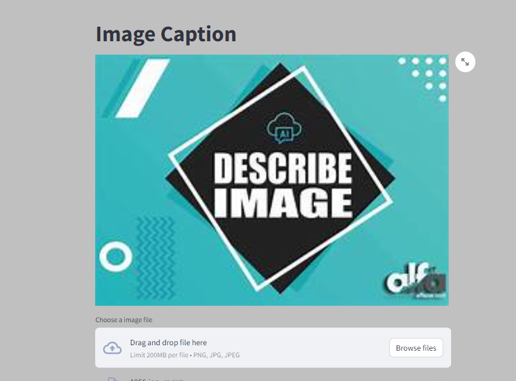
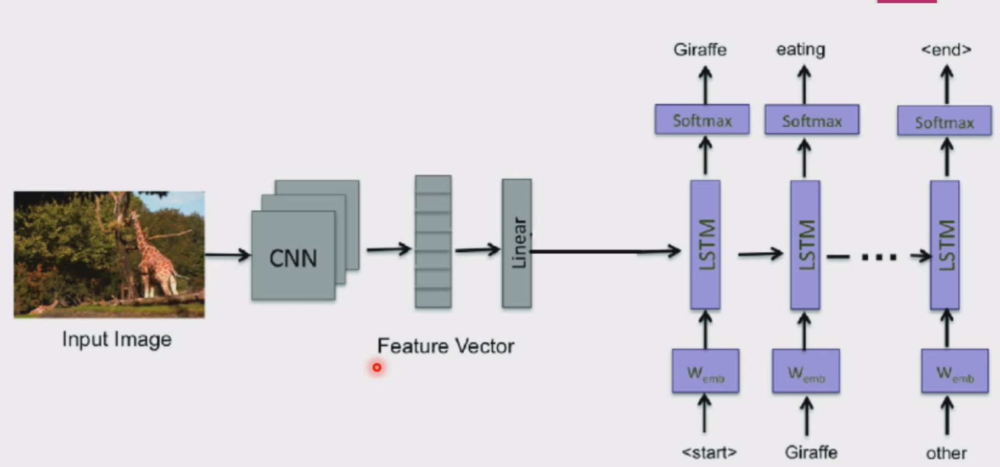

# Image-Captioning

USING CNN & LSTM - Deep Learning (DL): 🤖
TensorFlow: 🔧
Keras: 🧩
Image Caption: 📝
Model Saving: 💾

# Table of Contents

- [Overview](#overview)
- [Project Highlights](#Project-Highlights)
- [Installation](#Installation)
- [Usage](#Usage)
- [Contribution](#contribution)
- [License](#license)
- [Contact](#contact)

## Overview 
Image captioning involves using deep learning models, like CNNs for feature extraction and LSTMs for sequence generation, to create descriptive text for images. 
Leveraging frameworks like TensorFlow and Keras, models can be trained to interpret and describe visual content. 
This technology is used in various applications, from accessibility tools to social media platforms.



## Project Highlights

**Key Features:**

**Image Captioning**


## Installation

1. Clone this repository to your build machine using:

```bash
  git clone https://github.com/alexvatti/Image-Captioning.git
```
2. Navigate to the project directory:

```bash
  cd Image-Captioning
```
3. Install the required dependencies using pip:

```bash
  pip install -r requirements.txt
```

4. Open the Jupyter Notebook - Run the Code on the Choice of Platforms (Local/Google Colab/Kaggle)

```   
 Image Captioning.ipynb
```
## Usage

1. Run the Streamlit app by executing:
```bash
cd App
streamlit run app.py
```

2.The web app will open in your browser where you can upload the Image - It will caption/describe the Image

## Contribution

Feel free to contribute and enhance the project!

## License
This project is licensed under the [MIT License](LICENSE).

## Contact
For any inquiries or issues, please contact Alex at alexvatti@gmail.com
